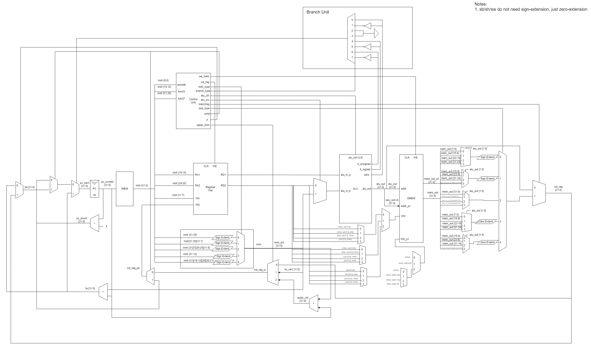
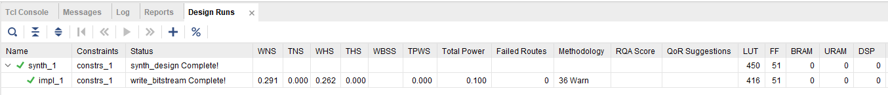
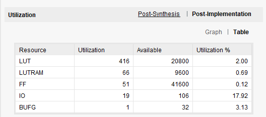

## One-RV32
One-RV32 is a single-cycle RISC-V CPU (RV32I).
 - Only supports the basic instructions and does not support the ECALL, FENCE, and EBREAK instructions
 - Verified using a "riscv-tests" suite (from https://github.com/regymm/quasiSoC, who got it originally from https://github.com/riscv-software-src/riscv-tests). Thank you! 
	 - Managed to catch lots of issues regarding load/store instructions with these
 - Also verified using manual testbenches for each instruction using simple tests
 - Tested on the Digilent Basys 3 FPGA development board at 100 MHz
 - Uses the Harvard Architecture (separate instruction and data memories)
 - Data memory is split into even and odd address banks
 - CPU and code is intended for educational purposes and is intended to be simplistic in order to be easy to understand

### Additional Details
The CPU uses a memory model that needs even-odd address memory banking. This was used in order to support unaligned memory accesses in a single clock cycle. Eventually, the plan is to make unaligned accesses require multiple cycles to simplify the memory and CPU design.

Diagram:

### Project Structure and Build
This was tested on the Digilent Basys 3 FPGA development board (FPGA model: xc7a35tcpg236-2L).

All Verilog source files are in the "rtl" folder.
All Verilog simulation files for testing are in the "tests" folder.
The constraint file is in the "boards" folder.

To remake the project in Vivado:

 1. Add "rtl" folder as a sources directory.
 2. Add "tests" folder as a simulation only directory.
 3. Add the constraint file for the specific board in the "boards" folder.
 4. **Make sure to add any memory initialization files** (in "tests" folder) manually into Vivado. (sometimes it does not add by itself for some reason)
 5. "cpu_top" is the top-level module that can be synthesized! "cpu_top_rvtests" and "cpu_top_verify" is intended for simulation only! (it has debug ports in the memory for easy testing)

The "cpu_top" module contains a simple factorial program. It calculates the factorial of 12. The last 5 switches on the Basys 3 board are intended to select a register from the register file. (The register file contains a debug port that can be removed later on manually.) The 6th rightmost switch is to select the upper or lower 16 bits of a selected register. It is then displayed on the 7 segment display. The center button can be used to reset the CPU too.

The "vivado" folder also contains an entire pre-built project that can be used directly if desired.

### Synthesis and Performance Images

Synthesis and Implementation Results (Utilization and Timing):

More Utilization Results:

### Todo:
 - Run some benchmarks on this CPU
 - Pass more formal compliance tests
 - Simplify memory design (maybe make this multi-cycle to support unaligned memory accesses in a slower way)
 - Support additional RISC-V instructions (multiplication and division)
 - Add more testing

### Acknowledgements
Thanks to:
https://github.com/regymm/quasiSoC for the riscv-tests. (as well as picorv32 and https://github.com/riscv-software-src/riscv-tests)

### License

This is licensed under GPL-3.0. Use at your own risk. It is intended for educational purposes.
 